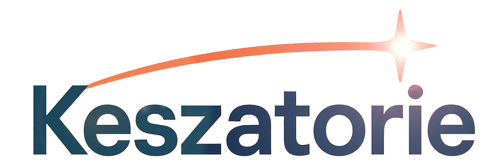

| | &nbsp;&nbsp;&nbsp;&nbsp;&nbsp;&nbsp;&nbsp;&nbsp;&nbsp;&nbsp;[Services](/services/) |&nbsp;&nbsp;[About](../about.md) |&nbsp;&nbsp; [Contact](../contact.md) &nbsp;&nbsp;|
  
# Contact Keszatorie

We’d love to learn about your AI goals and the roadblocks in your way. Whether you are piloting ChatGPT, rolling out Copilot, or building an enterprise roadmap, we help you turn promise into measurable outcomes.

---

## How to Reach Us
- **Email:** [keszatorie@gmail.com](mailto:keszatorie@gmail.com)
- **Location:** Near Seattle, Washington (Pacific Time, Mon–Fri)

We aim to reply within **1–2 business days**. If your request is time sensitive, please add “Urgent” in the subject line.

---

## What to Include in Your Message
To get you fast, relevant guidance, please share:
- **Your objective:** What problem are you trying to solve with AI?
- **Current state:** Tools in use, teams involved, and any constraints.
- **Success metrics:** How leadership will evaluate impact.
- **Timeline:** Pilot dates, decision milestones, or key launches.
- **Data & security needs:** Any compliance or governance requirements.

You can paste brief context or attach a single-page overview. If an NDA is required, mention it and we will send our standard mutual NDA.

---

## Typical Engagements
- **AI Optimization:** Consistency, accuracy, and reliability for ChatGPT and Copilot.
- **Enterprise Integration:** Smooth connections with your workflows and tools.
- **Performance Tracking:** Dashboards and KPIs that prove ROI.
- **Training & Enablement:** Playbooks, workshops, and ongoing support.

If you are unsure where to start, ask for a **readiness assessment** and we will map quick wins and longer-term opportunities.

---

## Project Fit Checklist
- You have a business outcome in mind, not just a tool to try.
- There is an internal sponsor and a small cross-functional team.
- You are open to piloting, measuring, then scaling.
- Security, compliance, and data stewardship matter.

If this sounds like you, we are a strong match! Yay!

---

## Next Step
Send a note to **[keszatorie@gmail.com](mailto:keszatorie@gmail.com)** with your goals and timeline. We will propose next steps, often starting with a short discovery call and a concise plan you can share with stakeholders.

---

    
---
#### This site is in Markdown
- [./readme.md](https://keszatorie.com/readme.md))
- [./services.md](https://keszatorie.com/services/index.md))
- [./ai-optimization.md](https://keszatorie.com/services/ai-optimization.md))
- [./enterprise-integration.md](https://keszatorie.com/services/enterprise-integration.md))
- [./performance-tracking.md](https://keszatorie.com/services/performance-tracking.md))
- [./training-and-enablement.md](https://keszatorie.com/services/training-and-enablement.md))
- [./about.md](https://keszatorie.com/about.md))  
- [./contact.md](https://keszatorie.com/contact.md))     
