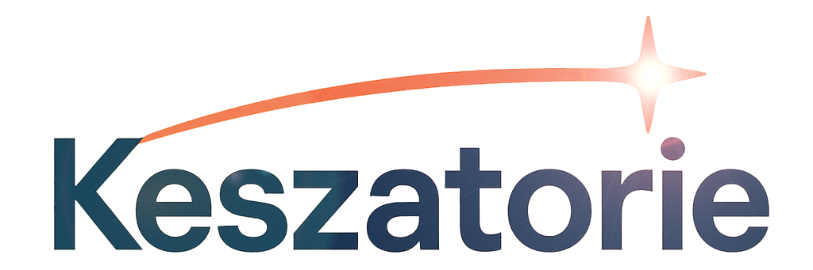

| | &nbsp;&nbsp;&nbsp;&nbsp;&nbsp;&nbsp;&nbsp;&nbsp;&nbsp;&nbsp;[Services](../services/) |&nbsp;&nbsp;[About](../about.md) |&nbsp;&nbsp; [Contact](../contact.md) &nbsp;&nbsp;|
  

# AI Optimization

AI tools like **ChatGPT** and **Copilot** are powerful, but without structure, they can feel unpredictable, inconsistent, and difficult to measure. At **Keszatorie**, our AI Optimization service is designed to take the guesswork out of generative AI and turn it into a reliable partner in your workflows.

---

## TL;DR
We make AI predictable, consistent, and measurable.  
Our AI Optimization service helps organizations refine how ChatGPT, Copilot, and related platforms are configured, prompted, and integrated — ensuring outputs align with your standards and deliver clear ROI.

---

## Jump to Sections
- [Why AI Optimization Matters](#why-ai-optimization-matters)  
- [Our Approach](#our-approach-to-ai-optimization)  
- [Benefits](#benefits-of-ai-optimization)  
- [Use Cases](#example-use-cases)  
- [What We Deliver](#what-we-deliver)  
- [Getting Started](#getting-started)  
- [Explore More](#explore-more)  

---

## Why AI Optimization Matters

Many organizations experiment with AI, only to encounter common challenges:

- Responses that vary in quality from one interaction to the next.  
- Confusion over how to structure prompts or workflows for consistent outputs.  
- Difficulty connecting AI usage to measurable business results.  
- Teams experimenting in silos without a strategy for scaling adoption.  

Our AI Optimization offering addresses these issues head-on by aligning **people, processes, and platforms** around the right practices.

---

## Our Approach to AI Optimization

We don’t just provide “prompt engineering” or quick fixes. Instead, we bring a systematic approach that ensures AI becomes a trusted asset for your business.  

### 1. Assessment
We begin with a diagnostic phase: reviewing your current use of ChatGPT, Copilot, and other AI platforms. This helps us surface gaps in consistency, security, and alignment with business goals.  

### 2. Optimization
Based on findings, we refine how you configure, prompt, and integrate AI into workflows. This might include:  

- Standardized prompt frameworks for repeatable results.  
- Structured knowledge bases to ground outputs in your company’s data.  
- API configurations that align AI with enterprise tools.  

### 3. Enablement
Optimization only succeeds if your teams feel confident. We provide playbooks, templates, and workshops that show employees how to use AI effectively without trial and error.  

### 4. Measurement
Finally, we design metrics and dashboards to track adoption, accuracy, and efficiency gains. This allows you to demonstrate ROI to leadership and continuously improve.

---

## Benefits of AI Optimization

When AI is tuned to your workflows, you gain:  

- **Consistency**: Outputs align with your standards every time.  
- **Scalability**: Teams share optimized practices instead of reinventing the wheel.  
- **Productivity**: Manual tasks shrink as AI delivers reliable results.  
- **Confidence**: Stakeholders trust the system because outcomes are measurable.  

---

## Example Use Cases

- **Customer Support**: Standardized prompts allow ChatGPT to draft responses that follow compliance rules and tone guidelines.  
- **Developer Productivity**: Copilot suggestions are refined with context from internal codebases, producing fewer errors and faster delivery.  
- **Marketing & Content**: AI-generated drafts use brand style sheets and terminology libraries to stay on-message.  
- **Operations**: Workflow automation integrates AI outputs with ticketing or CRM systems, reducing repetitive tasks.  

---

## What We Deliver

Our AI Optimization service typically includes:  

- **Prompt Frameworks** tailored to your industry and use cases.  
- **Knowledge Grounding** through structured data or document embedding.  
- **Integration Blueprints** for connecting AI APIs to enterprise software.  
- **Governance Guidelines** for security, compliance, and responsible usage.  
- **Measurement Dashboards** to track adoption, accuracy, and ROI.  

---

## Getting Started

The best way to begin is with a conversation about your current AI initiatives. We can run a **readiness assessment** to map out where optimization will make the fastest impact.  

From there, we design a roadmap that starts small, proves value, and then scales to additional teams and use cases.  

---

## Explore More

- [Back to Services Overview](../services.md)  
- [Enterprise Integration](./enterprise-integration.md)  
- [Performance Tracking](./performance-tracking.md)  
- [Training & Enablement](./training-and-enablement.md)  

---

**Ready to make AI work for you, not against you?**  
[Contact us](../contact.md) and let’s start optimizing.

    
---
#### This site is in Markdown
- [./services.md](https://keszatorie.com/services/index.md))
- [./ai-optimization.md](https://keszatorie.com/services/ai-optimization.md))
- [./enterprise-integration.md](https://keszatorie.com/services/enterprise-integration.md))
- [./performance-tracking.md](https://keszatorie.com/services/performance-tracking.md))
- [./training-and-enablement.md](https://keszatorie.com/services/training-and-enablement.md))
- [./about.md](https://keszatorie.com/about.md))  
- [./contact.md](https://keszatorie.com/about.md))
